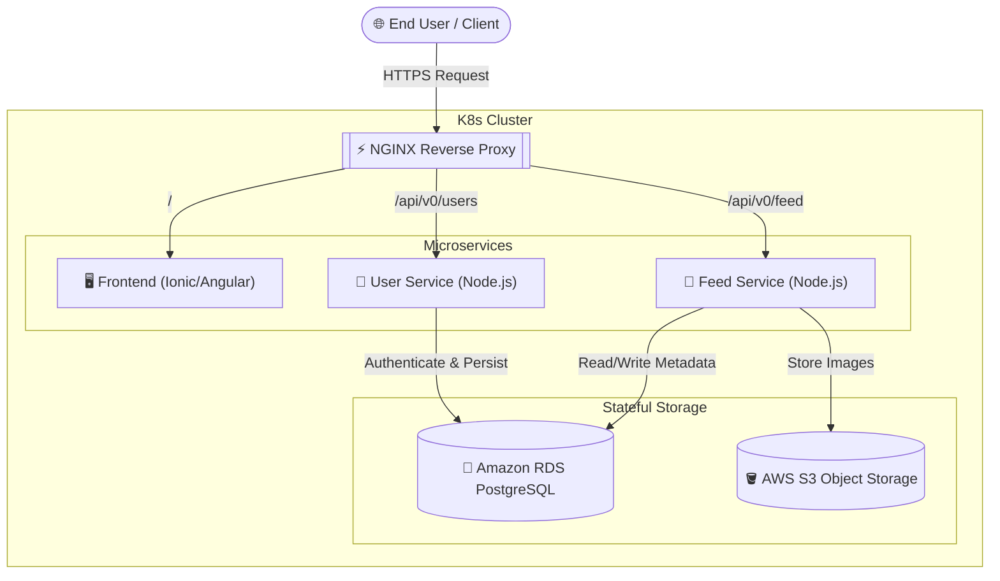

# 🌩️ Cloud-Native Microservices Architecture

[](https://kubernetes.io/)
[](https://www.docker.com/)
[](https://nodejs.org/)
[](https://angular.io/)
[](https://ionicframework.com/)
[](https://nginx.org/en/)

## 📌 Project Overview
This repository contains a full-stack, distributed **Cloud-Native Microservices Application**. It is designed to demonstrate advanced enterprise deployment patterns including containerization, container orchestration, reverse proxy API Gateways, and decoupled backend services.

The monolith has been broken down into independent microservices (`user-service`, `feed-service`, and `frontend`), all routed securely through an NGINX API Gateway, and deployed dynamically onto a Kubernetes (K8s) cluster.

## 🏗️ System Architecture



## 🛠️ Service Topology
| Microservice | Location | Responsibility |
| :--- | :--- | :--- |
| **Frontend** | `/frontend` | The client-facing Ionic/Angular SPA. |
| **User API** | `/user-service` | Handles JWT authentication, registration, and user data logic. |
| **Feed API** | `/feed-service` | Handles image feed management and uploads to S3. |
| **API Gateway** | `/deployment/docker/nginx.conf` | Routes external traffic to the correct internal microservice. |
| **Kubernetes** | `/deployment/k8s` | K8s manifests for Deployments, Services, ConfigMaps, and Secrets. |

## 🚀 Deployment Guide

### Local Deployment (Docker Compose)
To run the entire distributed architecture locally on your machine:
```bash
cd deployment/docker
docker-compose up --build
```

### Production Deployment (Kubernetes)
To deploy the microservices to an active AWS EKS or local Minikube cluster:
```bash
cd deployment/k8s

# 1. Apply Configuration and Secrets
kubectl apply -f env-configmap.yaml
kubectl apply -f env-secret.yaml
kubectl apply -f aws-secret.yaml

# 2. Deploy Microservices
kubectl apply -f backend-feed-deployment.yaml
kubectl apply -f backend-user-deployment.yaml
kubectl apply -f frontend-deployment.yaml
kubectl apply -f reverseproxy-deployment.yaml

# 3. Expose Services
kubectl apply -f backend-feed-service.yaml
kubectl apply -f backend-user-service.yaml
kubectl apply -f frontend-service.yaml
kubectl apply -f reverseproxy-service.yaml
```

## 👨‍💻 Cloud Architect
Engineered by **Lokesh Gounder**  
📧 [lokeshgounder@gmail.com](mailto:lokeshgounder@gmail.com)  
🔗 [GitHub Profile](https://github.com/LOKESH10796)
